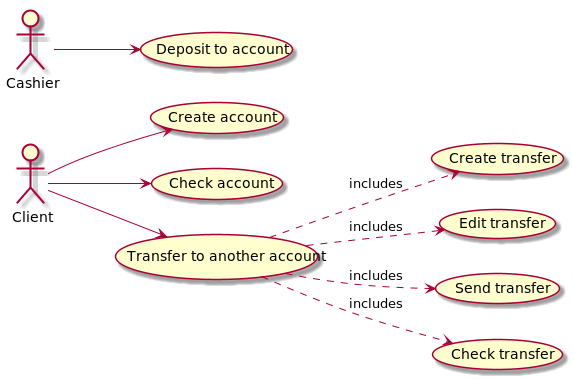
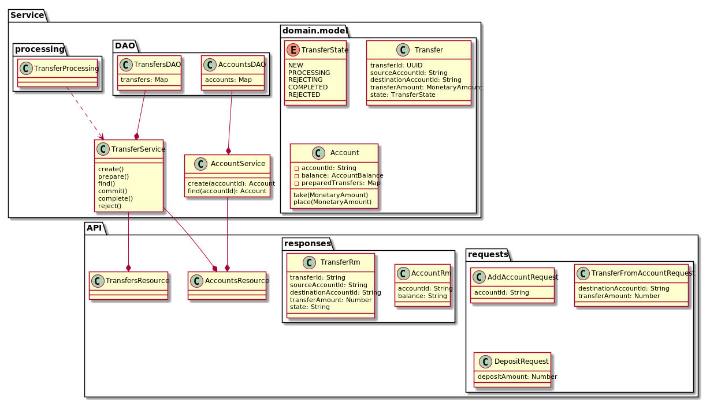

# jjtransfer - RESTful API for money transfer

API can be invoked by multiple service and systems on behalf of end users.
 
## Design
Implemented use cases


Class diagram and data model


## Build 
    
    mvn clean package

## Running
Start server on 8080 port:

    java -jar target/jjtransfer-<version>.jar

Start server on another port:
    
    java -Dhttp.port=8888 -jar target/jjtransfer-<version>.jar
    
... or start server by maven:
    
    mvn exec:java

### API
#### Accounts
##### Create account
    POST /accounts
Request:
```json
{
  "accountId" : "Alice"
}
```
Response: AccountRm
 ```json
{
   "accountId" : "userName",
   "balance" : "USD 1234.50000"
}
 ```  

##### Get account info
    GET /accounts/(id)
Response: AccountRm
##### Deposit to account
    POST /accounts/(id)/deposit
Request: 
```json
{
  "depositAmount" : 1234.5
}
```
#### Transfers
##### Prepare transfer
    POST /accounts/(id)/transfers
Request:
```json
{ 
  "destinationAccountId" : "Bob",
  "transferAmount" : 100 
}
```
Response: TransferRm
```json
{
  "transferId" : "<some uuid>",
  "sourceAccountId" : "Alice",
  "destinationAccountId" : "Bob",
  "transferAmount" : "USD 100.00000"
  "state" : "NEW"
}
```
##### Update prepared transfer
    PUT /accounts/(id)/transfers/(tid)
Response: TransferRm
    
##### Review prepared transfers    
    GET /accounts/(id)/transfers
Response: list of TransferRm    
##### Commit transfer
    POST /accounts/(id)/transfers/(tid)
Response: TransferRm     
