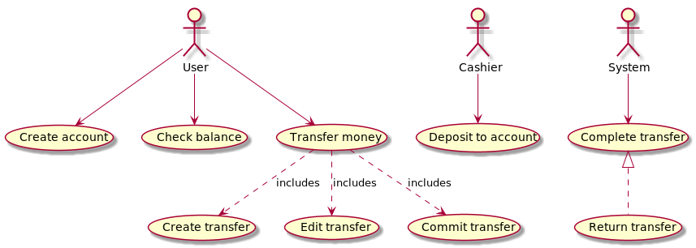

# jjtransfer - RESTful API for money transfer

API can be invoked by multiple service and systems on behalf of end users.
 
 
## Design
Implemented use cases

Class diagram and data model

### API
#### Accounts
    POST /accounts
    GET /accounts/(id) 
    GET /accounts
 
#### Transfers

    POST /accounts/(id)/transfers
    GET /accounts/(id)/transfers
    PUT /accounts/(id)/transfers/(tid)
    POST /accounts/(id)/transfers/(tid)
    GET /transfers

## Running
Start server on 8080 port:

    java -jar <app.jar

Start server on another port:
    
    java -jar <app.jar> -Dhttp.port=8888
    
Start server by maven:
    
    mvn exec:java

## Build 
    
    mvn clean package
